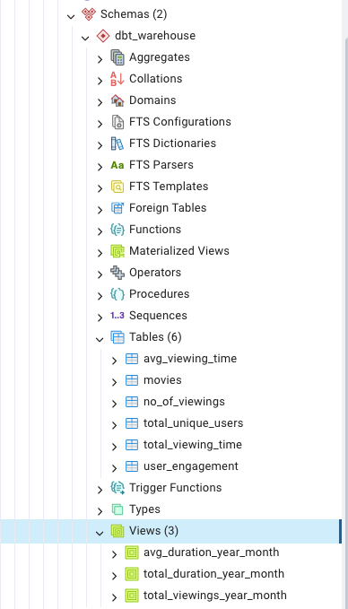

### Tables

Base on the BI Challenge, I decided to create facts table base on the queries before as they showed quantitative data so I created the following:

* No of Viewings
* Total Viewing Time
* Average Viewing Time
* Total Unique Users
* User Engagement

### Dimensions

From my understanding dimensions table contain qualitative data and describes attributes or characteristics on the dataset. Base on this, the `movies` table should be a dimension table instead. So I dropped the table in pgadmin and moved the `movies.sql` file to a new folder dimensions so it's clear this is not a fact table but rather a dimension table.

### Views

Base on what I have learnt, I decided views would be better given if this dataset was to be updated frequently and can help save storage as it's a predefined query and it's saves stakeholders from having to query the table directly. Also views can give restricted access and provides a sense of security when being used by stakeholders who would only need a high level overview of the total viewings and viewing time. 

I created the following views:
* Average Viewing Time Per Year Month
* Total Viewing Time Per Year Month
* Total Viewing Time Per Year Month

### Schema

Overall I created 6 tables - 5 fact tables, 1 dimension table and 3 views as summary tables. You can find the `dbt_warehouse` schema with the tables and views I have created to complete the challenge.

